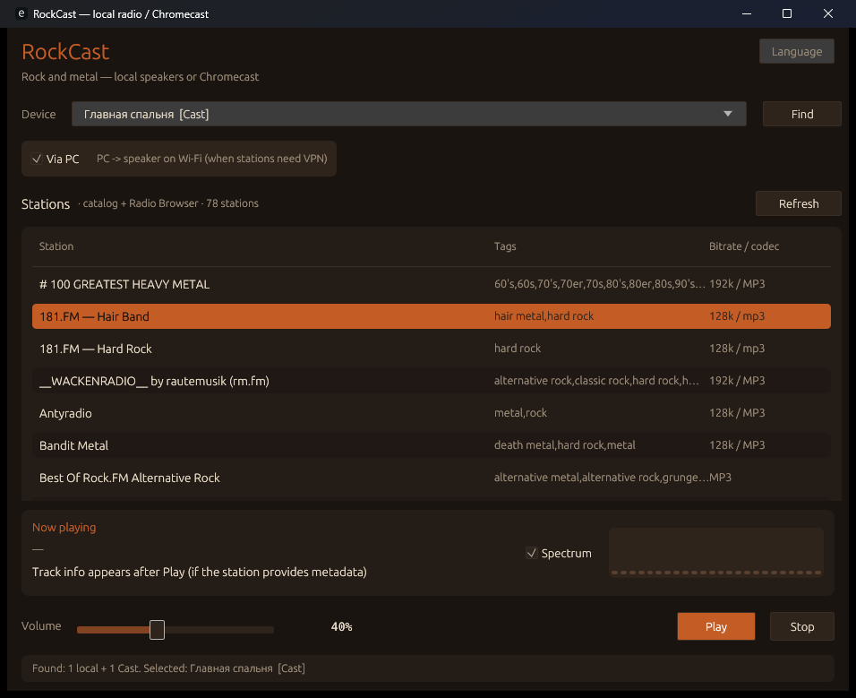

# RockCast

Desktop internet radio player for Windows and Linux. Play rock / metal streams on **PC speakers** or on **Google Cast** devices (Chromecast, Cast-enabled speakers such as JBL) using a native CASTV2 client — no Chrome browser required.



## Features

- **Local playback** — decode and play HTTP(S) radio streams on your PC (cpal + symphonia)
- **Google Cast** — discover receivers and stream live radio via CASTV2 (TLS + protobuf)
- **Via PC relay** — optional: PC fetches the station (e.g. through VPN) and serves it to the speaker on LAN
- **VPN-friendly discovery** — mDNS plus a LAN `/24` TCP scan with Cast `eureka_info` (works when Amnezia / WireGuard breaks multicast)
- **Station catalog** — bundled `stations.txt` plus optional enrichment from [Radio Browser](https://www.radio-browser.info/)
- **Now playing** — ICY / Shoutcast `StreamTitle` when the station provides metadata
- **Spectrum visualizer** — optional FFT bars (uses the same local decode path or a stream tap for Cast)
- **Bilingual UI** — Russian and English
- **Persistent settings** — volume, last station, device, language, spectrum toggle
- **Optional RockServer mode** — server-side semantic station search and a bounded SpeechKit voice command; autonomous mode remains the default

## Requirements

- Windows 10 / 11, or Linux (X11 or Wayland; audio via ALSA / PipeWire)
- [Rust](https://rustup.rs/) toolchain (edition 2024 / recent stable)
- Same Wi‑Fi / LAN as your Cast device for casting
- Optional: Amnezia or other VPN — Cast discovery still works via subnet scan if LAN unicast is allowed

### Linux packages (Fedora / Kinoite distrobox)

Build the GUI and cpal against system libraries:

```bash
sudo dnf install gcc gcc-c++ make pkgconf-pkg-config \
  alsa-lib-devel libxkbcommon-devel wayland-devel \
  libX11-devel libXcursor-devel libXrandr-devel libXi-devel mesa-libGL-devel
```

On Fedora Kinoite keep the toolchain in rustup (`~/.cargo`) inside toolbox/distrobox — do not layer `rust`/`cargo` with `rpm-ostree`.

Debian/Ubuntu equivalents: `build-essential pkg-config libasound2-dev libxkbcommon-dev libwayland-dev libx11-dev libxcursor-dev libxrandr-dev libxi-dev libgl1-mesa-dev`.

## Quick start

Windows:

```bat
run.bat
```

Linux:

```bash
./run.sh
```

Or manually:

```bash
cargo run --release
```

Debug build:

```bash
cargo run
```

Logging (default level `info`):

```bash
# Windows
set RUST_LOG=info
cargo run --release

# Linux / macOS
RUST_LOG=info cargo run --release
```

Useful levels: `rockcast=debug`, `rockcast::cast::discovery=debug`.

## Using the app

1. **Wait for stations** — the local catalog loads immediately; Radio Browser enrichment may follow in the background.
2. **Find devices** — click **Find** to scan PC audio outputs and Cast receivers on the LAN.
3. **Select output** — choose **This PC** (speakers) or a Cast device (e.g. a JBL speaker).
4. **Via PC** (Cast only) — enable if the station needs VPN on the PC; RockCast relays audio to the speaker over Wi‑Fi.
5. **Select a station** — click a row in the list.
6. **Play / Stop** — start or stop playback.
7. **Volume** — slider; Cast volume is scaled so the UI “100%” maps to a comfortable speaker level.
8. **Spectrum** — enable for the equalizer-style visualizer (extra network use when casting).
9. **Language** — switch Russian / English from the UI; the choice is saved.

### Cast notes

- Discovery runs **mDNS** (`_googlecast._tcp`) on the real LAN NIC and, in parallel, a **unicast scan** of `x.x.x.1–254` for TCP **8009**, then reads `http://<ip>:8008/setup/eureka_info`.
- Split-tunnel VPN exclusions often fix unicast but **not** multicast; the subnet scan is what finds devices like JBL when mDNS returns nothing.
- Playback on Cast uses CASTV2: connect → launch Default Media Receiver → `LOAD` the live stream URL.
- With **Via PC**, `LOAD` points at `http://<PC-LAN-IP>:<port>/stream` while the PC downloads the station (through VPN if needed). Allow inbound LAN (Windows Firewall / firewalld) if prompted.

### Local playback notes

- Uses the selected output device (or the system default): WASAPI on Windows, ALSA (PipeWire/Pulse) on Linux.
- Supports common stream codecs handled by symphonia (MP3, AAC, Ogg/Vorbis, FLAC, etc., depending on the station).
- Track titles come from ICY metadata when available.

## Station catalog

### Format (`stations.txt`)

```text
# name | url | tags | bitrate | codec | country
SomaFM — Metal Detector | https://ice6.somafm.com/metal-128-mp3 | metal,heavy metal | 128 | mp3 | USA
```

- Lines starting with `#` are comments.
- At least `name` and `url` are required (`http://` or `https://`).
- Playlist URLs (`.m3u`, `.pls`, …) from Radio Browser are skipped.

### Where the file is loaded from

Search order:

1. `ROCKCAST_STATIONS` environment variable (full path)
2. `stations.txt` next to the executable
3. `stations.txt` in the current working directory
4. App data dir `stations.txt` (created from the embedded catalog if missing):
   - Windows: `%LOCALAPPDATA%\RockCast\stations.txt`
   - Linux: `$XDG_CONFIG_HOME/rockcast/stations.txt` or `~/.config/rockcast/stations.txt`

### Radio Browser

After the local list appears, RockCast may query Radio Browser for additional metal/rock stations and merge them (deduped by URL, capped for UI size).

## Settings

Stored at:

```text
Windows: %LOCALAPPDATA%\RockCast\settings.json
Linux:   ~/.config/rockcast/settings.json
```

Typical fields: `volume`, `station_url`, `device_id`, `eq_enabled`, `cast_relay`, `language`, and the optional RockServer URL/token settings.

## RockServer and voice control

RockCast starts in autonomous mode and continues to use its local catalog plus Radio Browser exactly as before. Enable **RockServer (search and voice)** in the window only when a local or LAN RockServer is running; the default URL is `http://127.0.0.1:3000` and is saved locally. Enter the `ROCKSERVER_API_BEARER_TOKEN` in the masked **Токен** field. RockCast sends it as `Authorization: Bearer <token>` for both HTTP search and the voice WebSocket handshake; it never appends the credential to the server URL or writes it to the application log. The query box uses `/v1/search`. If the server is unavailable or returns an error, RockCast falls back to the autonomous catalog.

The **Voice** button records PCM16 mono from the default Windows microphone until release or the 60-second limit, sends it to `/api/v1/voice/stream`, and plays the station selected by the server when the command requests playback. In RockServer settings, choose **Buffered (after recording)** for the compatible SpeechKit v1 request, or **Streaming (while recording)** for SpeechKit v3 partial recognition. In streaming mode RockCast opens the WebSocket before microphone capture and sends PCM chunks as they arrive; buffered mode retains the original upload-after-release behavior. The choice is saved locally and sent with each new voice session; RockServer must be configured with the local Yandex SpeechKit credentials. RockCast never stores or sends SpeechKit credentials. Input-device selection/testing and cancellation after upload begins are not implemented yet.

## Project layout

```text
rockcast/
├── Cargo.toml
├── stations.txt          # bundled rock/metal catalog
├── run.bat               # Windows release launcher
├── run.sh                # Linux release launcher
├── docs/                 # architecture & agent-oriented code docs
├── proto/                # Cast channel protobuf reference
├── examples/
│   └── cast_probe.rs     # CLI discovery probe
└── src/
    ├── main.rs           # GUI entry
    ├── lib.rs
    ├── app/              # egui UI (theme, actions, ui panels)
    ├── playback/         # PlaybackController + phase/volume
    ├── local/            # PC playback (cpal + decode)
    ├── observers/        # ICY + spectrum taps for Cast
    ├── stations/         # catalog + Radio Browser
    ├── relay/            # LAN HTTP relay PC → Cast
    ├── voice/            # RockServer voice search
    ├── i18n.rs           # EN / RU strings
    ├── output.rs         # local + Cast device list
    ├── settings.rs
    └── cast/
        ├── discovery/    # mDNS + subnet scan
        ├── client/       # CASTV2 play / stop / volume
        ├── channel/      # TLS framing + auth
        │   ├── recv.rs   # read loop / inbox
        │   └── tls.rs    # connect
        └── proto.rs      # hand-rolled CastMessage codec
```

Code architecture, module map, playback/Cast flows, and notes for AI coding agents: **[docs/README.md](docs/README.md)**.

## Development

### Build

```bash
cargo build --release
```

Binary: `target/release/rockcast.exe` (Windows) or `target/release/rockcast` (Linux).

### Tests

```bash
cargo test --lib
```

Discovery tests include VPN interface name filters and a live LAN probe (skipped automatically if `192.168.31.109:8009` is not open on your network — adjust or ignore as needed).

### Cast discovery probe

```bash
cargo run --example cast_probe
```

Prints every Cast receiver found via mDNS and/or subnet scan (about 8 seconds).

### Architecture (short)

| Path | Role |
|------|------|
| UI thread (egui) | Renders UI; starts background work for scan / play / stop |
| `LocalPlayer` | HTTP stream → decode → ring buffer → cpal output + optional FFT |
| `CastService` | CASTV2 session, heartbeat, volume, `LOAD` / `STOP` |
| `StreamRelay` | Optional LAN HTTP proxy: PC fetches station, Cast LOADs local URL |
| Discovery | LAN NIC whitelist (skip Amnezia/Hyper-V/…) + mDNS + `/24` TCP probe |

## Troubleshooting

| Symptom | What to try |
|---------|-------------|
| No Cast devices | Click **Find** again; ensure PC and speaker are on the same LAN; allow LAN in VPN; run `cargo run --example cast_probe` |
| Cast found, play fails | Confirm the station URL plays on PC first; check firewall for outbound HTTPS to the stream and TCP 8009 to the device |
| Station needs VPN, silent on JBL | Enable **Via PC**; allow inbound LAN (Windows Firewall / firewalld); PC and JBL on same Wi‑Fi |
| Empty station list | Check `stations.txt` path / `ROCKCAST_STATIONS`; inspect logs for Radio Browser errors |
| No track title | Many stations do not send ICY metadata |
| Wrong PC audio device | Pick another entry under **Device** after **Find** |
| Spectrum silent on Cast | Enable spectrum; Cast mode uses a separate stream tap after the receiver starts |

## License

No license file is included in the repository yet. Add one if you distribute binaries or source publicly.

## Acknowledgments

- [Radio Browser](https://www.radio-browser.info/) — community station directory
- [SomaFM](https://somafm.com/), Rock Antenne, and other listed stations — streams referenced in the default catalog
- Google Cast / CASTV2 protocol community documentation
