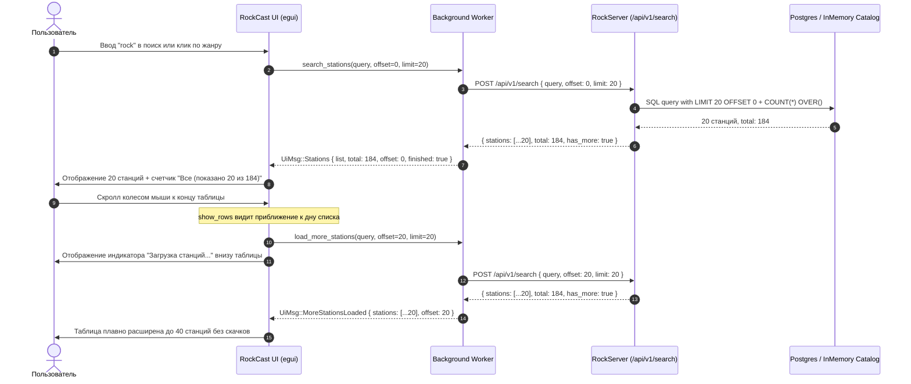

# Архитектурный план: Полноценная пагинация, автоскролл и навигация по каталогу RockCast (без костылей)

## 1. Описание задачи и текущие ограничения
В настоящее время поиск по радиостанциям в RockCast жестко ограничен первыми 20 результатами:
- `POST /api/v1/search` в `RockServer` принудительно ограничивает выдачу `limit: 20` и отвергает неизвестные поля (`#[serde(deny_unknown_fields)]`).
- В клиенте `RockCast` результат заменяет весь список, создавая ложное впечатление, что станций всего 20.
- Невозможно просмотреть станции с 21-й по N-ю.

**Цель:** Создать чистое, архитектурно правильное решение от бэкенда до фронтенда:
1. **RockServer**: Добавить официальную поддержку смещения (`offset`), общего количества найденных совпадений (`total`) и флага наличия следующих страниц (`has_more`).
2. **RockCast (Network/State)**: Полноценный асинхронный батчинг результатов по страницам.
3. **RockCast (UI/UX)**:
   - Бесшовный бесконечный скролл (Infinite Scroll) с виртуализацией строк (`ScrollArea::show_rows`) в `egui` для сохранения 60 FPS при сотнях станций.
   - Деликатный футер-индикатор загрузки и кнопка повтора при сбое сети.
   - Плавающая кнопка возврата `↑ Наверх` и центрирование на играющем треке `⌖ К текущей`.
   - Честные информативные счётчики в шапке (`Все: показано 40 из 184`).
   - Быстрые фасетные фильтры (по стране и битрейту) над таблицей.

---

## 2. Архитектурная схема взаимодействия



---

## 3. Детальный план изменений

### Этап 1: Серверный слой (`C:\repos\rockserver`)

#### 1. `src/http/search.rs`
- Расширить `SearchRequestDto`:
  ```rust
  pub(super) struct SearchRequestDto {
      pub(super) query: String,
      #[serde(default)]
      pub(super) locale: Option<String>,
      #[serde(default)]
      pub(super) limit: Option<u8>,
      #[serde(default)]
      pub(super) offset: Option<usize>, // <-- Официальное смещение
      #[serde(default)]
      pub(super) exclude_station_ids: Vec<String>,
  }
  ```
- В `ValidatedSearchRequest`: добавить поле `offset: usize` (по умолчанию 0).
- Расширить `SearchResponseDto` в `src/http/transport.rs`:
  ```rust
  pub(super) struct SearchResponseDto {
      pub(super) request_id: String,
      pub(super) normalized_query: NormalizedQueryDto,
      pub(super) stations: Vec<StationResultDto>,
      pub(super) total: usize,       // <-- Общее количество найденных в каталоге
      pub(super) has_more: bool,     // <-- offset + limit < total
  }
  ```

#### 2. `src/search/domain.rs` & `src/search/mod.rs`
- В `SearchConstraints` добавить `pub offset: usize`.
- В `SearchOutcome` добавить `pub total: usize`.

#### 3. `src/search/ranking.rs` & `src/search/in_memory.rs`
- В `rank_stations`:
  ```rust
  let total = results.len();
  let paged = results
      .into_iter()
      .skip(constraints.offset)
      .take(constraints.limit)
      .collect();
  ```

#### 4. `src/persistence/postgres.rs`
- В `SEARCH_SQL`:
  - В финальный `SELECT` добавить `COUNT(*) OVER() AS total_matches`.
  - В условие завершения добавить `OFFSET $17`.
  - Привязывать `parameters.offset` в `query_as`.

#### 5. `tests/search_api.rs`
- Добавить тесты пагинации:
  - `offset_returns_next_page_of_results()`
  - `total_and_has_more_are_reported_accurately()`

---

### Этап 2: Сетевой слой и состояние клиента (`c:\repos\rockcast`)

#### 1. `src/rockserver.rs`
- Добавить поля `offset` в `SearchRequest` и `total`, `has_more` в `SearchResponse`.
- Создать структуру `SearchBatch { pub stations: Vec<Station>, pub total: usize, pub has_more: bool }`.
- Обновить `rockserver::search(...)` с сигнатурой:
  ```rust
  pub(crate) fn search(
      config: &RuntimeConfig,
      query: &str,
      locale: &str,
      limit: u8,
      offset: usize,
  ) -> Result<SearchBatch, String>
  ```

#### 2. `src/app/messages.rs`
- Добавить сообщения для асинхронной подгрузки:
  ```rust
  UiMsg::MoreStationsLoaded {
      list: Vec<Station>,
      request_id: u64,
      offset: usize,
      total: usize,
      has_more: bool,
  },
  UiMsg::MoreStationsFailed {
      request_id: u64,
      error: String,
  },
  ```

#### 3. `src/app/mod.rs`
- Расширить состояние `RockCastApp`:
  - `pub(super) station_search_total: Option<usize>`
  - `pub(super) station_search_offset: usize`
  - `pub(super) station_has_more: bool`
  - `pub(super) loading_more_stations: bool`
  - `pub(super) loading_more_error: Option<String>`
  - `pub(super) selected_country: Option<String>`
  - `pub(super) selected_min_bitrate: Option<u32>`

#### 4. `src/app/actions/catalog.rs` & `src/app/actions/poll/catalog.rs`
- В `search_stations`: инициализировать `offset = 0`, сбрасывать `station_has_more = true`.
- Реализовать `load_more_stations(&mut self)`:
  - Проверять guards: `!self.loading_stations && !self.loading_more_stations && self.station_has_more`.
  - Запускать фоновую задачу со следующим `offset`.
  - При получении `UiMsg::MoreStationsLoaded`: дописывать станции через `self.stations.extend(...)` и ставить иконки в очередь кэширования.

---

### Этап 3: Пользовательский интерфейс (`src/app/ui/stations/...`)

#### 1. `src/app/ui/stations.rs`
- **Виртуализация `egui`:**
  Заменить плоский цикл на `egui::ScrollArea::vertical().show_rows(...)`:
  ```rust
  let row_h = theme::ROW_H;
  let total_rows = rows.len();
  let scroll_output = egui::ScrollArea::vertical()
      .id_salt("stations_scroll")
      .auto_shrink([false, false])
      .max_height(layout.scroll_h)
      .min_scrolled_height(layout.scroll_h)
      .show_rows(ui, row_h, total_rows, |ui, row_range| {
          // Рендерим ТОЛЬКО видимые строки в окне
          for row_pos in row_range.clone() {
              self.draw_station_row_at(ui, &layout, row_w, row_pos, &rows[row_pos]);
          }
          // Автодетект приближения к концу: если видимый диапазон подошёл к дну
          if row_range.end >= total_rows.saturating_sub(2) {
              need_load_more = true;
          }
      });
  ```
- **Футер таблицы:**
  - Если `loading_more_stations`: анимированный индикатор загрузки (`"Загрузка станций…"`).
  - Если `loading_more_error`: кнопка повтора `[ Ошибка сети. Загрузить ещё ↻ ]`.
  - Если достигнут конец (`!station_has_more && total > 20`): `✓ Показаны все N станций`.
- **Плавающая кнопка `↑ Наверх`:**
  - Если скролл опустился ниже 400px (`scroll_output.state.offset.y > 400.0`), в нижнем правом углу панели рисуется аккуратная кнопка с ховером: `↑ Наверх`. Клик мгновенно переносит на `scroll_to_station = Some(0)`.

#### 2. `src/app/ui/stations/filter_chips.rs`
- **Честный счётчик:**
  - Показывать: `Все (40 из 184)` если подгружено частично, либо `Все (184)` если список загружен полностью.
- **Фасетные чипы:**
  - Добавить компактные выпадающие кнопки `[ 🌍 Страна ▾ ]` и `[ ⚡ Качество ▾ ]`:
    - Страна: `Все`, `US`, `DE`, `GB`, `RU`, `CA`, `FR`, `SE` и др.
    - Качество: `Любой битрейт`, `≥ 128 kbps`, `≥ 192 kbps`, `320 kbps (HQ)`.

#### 3. `src/app/ui/controls.rs`
- В нижний плеер добавить кнопку `⌖` рядом с названием играющего трека (всплывающая подсказка: *«Показать играющую станцию в списке»*), которая активирует `self.scroll_to_station = self.selected_station`.

---

## 4. План проверки (Verification Plan)

### Автоматические тесты
1. **RockServer тесты поиска и пагинации:**
   ```powershell
   cargo test --test search_api --manifest-path C:\repos\rockserver\Cargo.toml
   ```
   *Критерий успеха:* все существующие и новые тесты пагинации (`offset`, `total`, `has_more`) проходят успешно.

2. **RockCast регрессионные и модульные тесты:**
   ```powershell
   cargo test --lib
   ```
   *Критерий успеха:* 182+ теста проходят без сбоев.

### Ручная проверка
1. **Запуск RockCast:**
   ```powershell
   cargo run
   ```
2. **Проверка поиска:**
   - Вбить запрос `rock` или нажать чип `Metal`.
   - Убедиться, что чип показывает `Все (показано 20 из N)`.
   - Проскроллить вниз до 20-й строки — список должен автоматически и плавно расшириться до 40, затем до 60 станций.
   - Убедиться, что в процессе скролла ничего не дёргается и FPS остаётся высоким благодаря `show_rows`.
3. **Проверка навигации:**
   - Проскроллить на 80-ю станцию. В правом нижнем углу нажать `↑ Наверх` — проверить мгновенный возврат в начало.
   - Включить воспроизведение станции, проскроллить вниз, нажать кнопку `⌖` в плеере — проверить центрирование на играющей станции.
4. **Проверка фасетов:**
   - Выбрать страну `DE` или битрейт `≥ 192 kbps` — список должен мгновенно отфильтроваться.
5. **Снятие проверочного скриншота:**
   - Выполнить `powershell -File scripts/take_screenshot.ps1` и визуально проверить финальный вид интерфейса.
